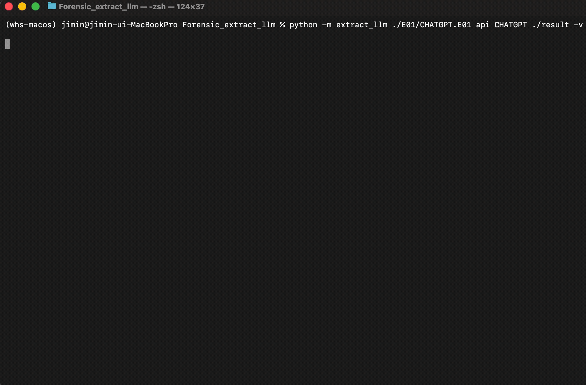

# extract_llm

> E01 디스크 이미지에서 LLM 애플리케이션의 포렌식 아티팩트를 자동으로 추출하는 도구

  

---

## 데모(Demo)

<p align="center">
  
</p>

---

## 개요(Overview)

**dfVFS**로 E01 이미지를 파싱하고, 앱별 경로 패턴(`artifacts.json`) 또는 **휴리스틱 패턴**을 재귀적으로 탐색하여 결과 폴더로 정리합니다.

```
E01 이미지  →  파티션 탐색  →  경로 패턴 매칭  →  아티팩트 추출  →  리포트 저장
```

---

## 주요 특징(Features)

| 기능 | 설명 |
|------|------|
| **세 가지 출력 모드** | 기본(minimal) / 컬러(`-c`) / 상세(`-v`) |
| **포렌식 로깅** | SHA-256, 도구 버전, 실행 컨텍스트, 성공/실패 카운트, 소요 시간 → `extraction_report.txt` |
| **휴리스틱 모드** | 미정의 LLM 이름 입력 시 `api`/`standalone` 기본 경로 패턴으로 자동 탐색 |
| **카테고리 수집** | `Program_Execution_Traces` / `User_Info` / `Prompt+File_Uploads` / `Network` 구조화 |
| **부분 추출** | `Cookies`, `Network Persistent State` 등 지정 파일만 선별 추출 가능 |

> 세부 경로 패턴은 [`artifacts.json`](extract_llm/artifacts.json)을 참고하세요.

---

## 지원 대상

| MODE | LLM |
|------|-----|
| `api` | `CHATGPT`, `CLAUDE` |
| `standalone` | `LMSTUDIO`, `JAN` |
| 두 모드 모두 | 그 외 임의 LLM 이름 → **휴리스틱 모드** |

---

## 요구 사항(Requirements)

- **Python** 3.9 이상
- **Python 패키지**: `dfvfs`, `pytsk3`, `libewf-python`, `rich`

| 플랫폼 | 네이티브 라이브러리 |
|--------|-------------------|
| Ubuntu / WSL | `libtsk-dev`, `libewf-dev`, `libbde-dev`, `libfsntfs-dev`, `build-essential`, `python3-dev` |
| macOS (Homebrew) | `sleuthkit`, `libewf`, `pkg-config` |
| Windows | WSL(Ubuntu) 사용 권장 |

---

## 설치 및 실행(Quick Start)

### 1) 리포지토리 클론
```bash
git clone https://github.com/forensicbread/WHS_extract_llm.git
cd WHS_extract_llm
```

### 2) Windows (WSL-Ubuntu) — 자동 설치
```bash
# PowerShell(관리자)에서 WSL 설치
wsl --install -d Ubuntu
# 재부팅 후 WSL 실행, 리포지토리로 이동

chmod +x setup_wsl.sh
sed -i 's/\r$//' setup_wsl.sh && bash ./setup_wsl.sh

source ~/venvs/whs-windows/bin/activate
python -m extract_llm ./E01/CLAUDE.E01 api CLAUDE ./result
```

### 3) Windows (WSL-Ubuntu) — 수동 설치
```bash
sudo apt update
sudo apt install -y python3-venv python3-dev build-essential \
    libtsk-dev libewf-dev libbde-dev libfsntfs-dev

python3 -m venv --prompt whs-windows ~/venvs/whs-windows
source ~/venvs/whs-windows/bin/activate

pip install --upgrade pip setuptools wheel
pip install -r requirements.txt

python -m extract_llm ./E01/CLAUDE.E01 api CLAUDE ./result
```

### 4) macOS — 자동 설치
```bash
chmod +x setup_macos.sh
./setup_macos.sh

source .venv-macos/bin/activate
python -m extract_llm ./E01/CLAUDE.E01 api CLAUDE ./result
```

---

## 명령줄 사용법(Usage)

```bash
python -m extract_llm <E01_IMAGE> <MODE> <LLM_NAME> <OUTPUT_DIR> [옵션]
```

### 인수

| 인수 | 설명 |
|------|------|
| `E01_IMAGE` | 분석할 E01 이미지 파일 경로 |
| `MODE` | `api` 또는 `standalone` |
| `LLM_NAME` | `CHATGPT` / `CLAUDE` / `LMSTUDIO` / `JAN` / *(그 외 → 휴리스틱)* |
| `OUTPUT_DIR` | 결과 저장 폴더 (없으면 자동 생성) |

### 옵션(Flags)

| 플래그 | 설명 |
|--------|------|
| `-c`, `--color` | 컬러 출력 활성화 |
| `-v`, `--verbose` | 상세 모드 (헤더 / 카테고리 요약 / 최종 테이블) |
| `--hash` | 소스 E01 이미지 SHA-256 계산 및 로그 기록 *(기본: 생략)* |
| `-p`, `--no-keep-plus` | 카테고리 폴더명에서 `+` → `_` 치환 |
| `-s`, `--no-final-summary` | 마지막 요약 메시지 생략 |

### 예시(Examples)

```bash
# 기본 실행
python -m extract_llm ./E01/CHATGPT.E01 api CHATGPT ./result

# 컬러 출력
python -m extract_llm ./E01/CHATGPT.E01 api CHATGPT ./result -c

# 상세 모드
python -m extract_llm ./E01/CLAUDE.E01 api CLAUDE ./result -v

# SHA-256 계산 포함
python -m extract_llm ./E01/CLAUDE.E01 api CLAUDE ./result --hash

# 폴더명 '+' → '_' 치환
python -m extract_llm ./E01/LMSTUDIO.E01 standalone LMSTUDIO ./result -p

# 미정의 LLM (휴리스틱 모드)
python -m extract_llm ./E01/MYAPP.E01 api MYAPP ./result -v
```

---

## 결과물(Output)

```
result/
└── <LLM_NAME>/
    ├── Program_Execution_Traces/   # Prefetch, 로그 파일
    ├── User_Info/                  # 사용자 프로필, LevelDB
    ├── Prompt+File_Uploads/        # 캐시, 대화 데이터
    ├── Network/                    # Cookies, Network Persistent State
    └── extraction_report.txt       # 실행 리포트
```

`extraction_report.txt` 포함 내용:
- 이미지 파일명/경로, SHA-256 (선택), LLM 타깃/모드, 실행 명령줄, 타임스탬프
- 카테고리별 성공/실패 카운트, 전체 소요 시간
- 경로별 상세 성공/실패 로그

---

## 동작 개요(How it works)

```
1. 이미지 파티션 탐색   /p1 … /p10 순회 → NTFS + Windows 폴더 확인
2. 경로 정규화         \→/ 변환, 대소문자 무시, 와일드카드(*) 처리
3. 카테고리별 재귀 탐색  artifacts.json 패턴 또는 휴리스틱 패턴으로 매칭
4. 부분 추출           extract_files 키로 지정된 파일만 선별
5. 리포트 저장         extraction_report.txt + 화면 요약 출력
```

---

## 프로젝트 구조(Project Structure)

```
WHS_extract_llm/
├── extract_llm/
│   ├── __init__.py       # 버전 정보
│   ├── __main__.py       # 패키지 진입점
│   ├── cli.py            # 메인 로직 (파싱, 추출, 리포트)
│   └── artifacts.json    # LLM별 아티팩트 경로 정의
├── etc/
│   └── extract_llm.gif   # 데모 GIF
├── setup_wsl.sh          # WSL 자동 설치 스크립트
├── setup_macos.sh        # macOS 자동 설치 스크립트
├── requirements.txt
└── pyproject.toml
```
